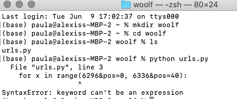
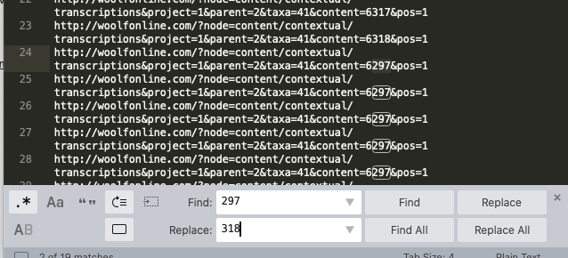
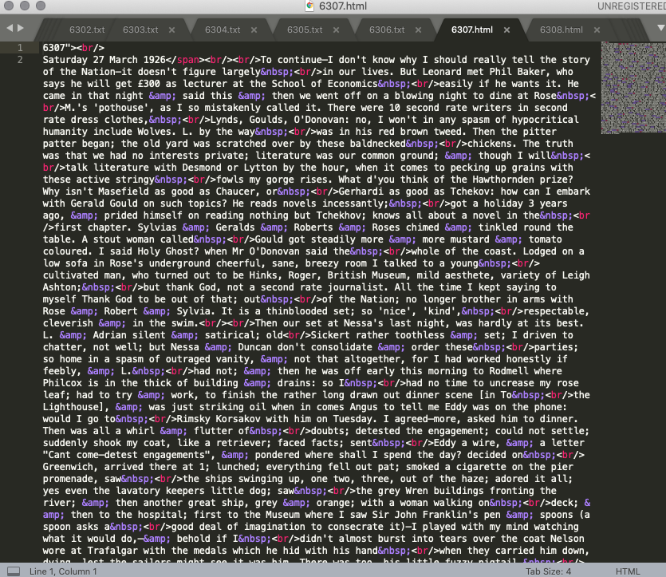
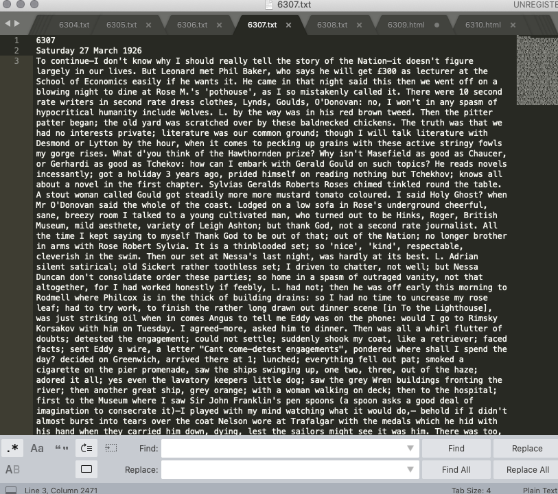
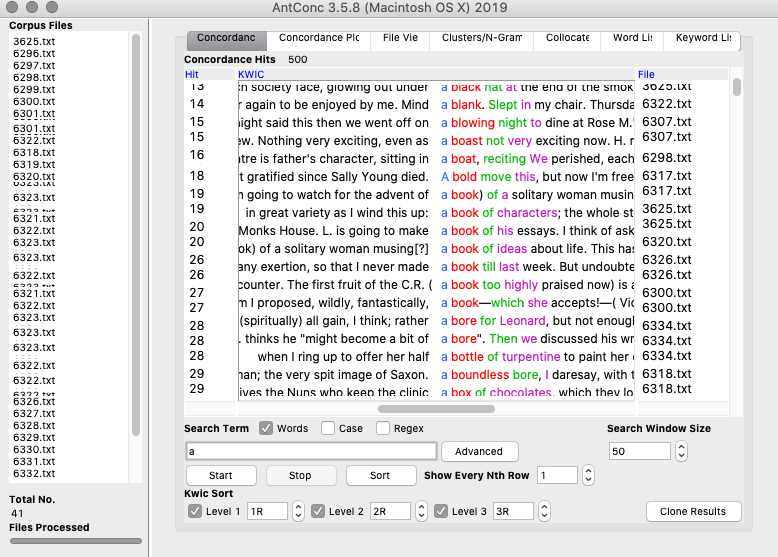
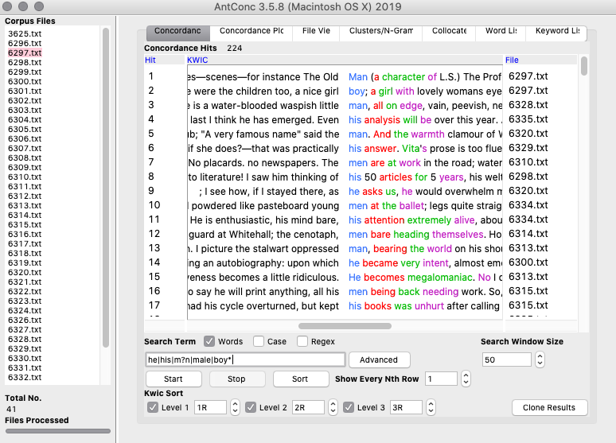
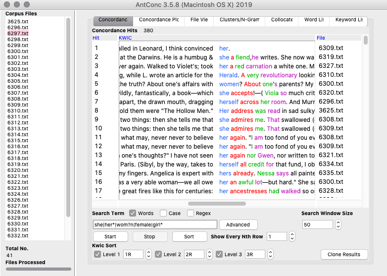
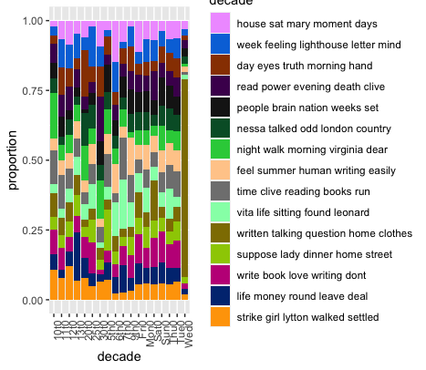
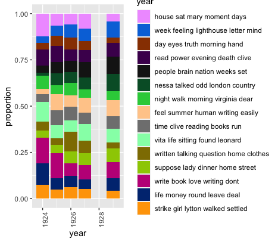

# Week six notes

- Virginia Woolf's diaries from 1924 to 1929 while writing and publishing her novel, To The Lighthouse

### guiding research questions
- what approach best suits the story/message/finding that you're trying to convey?
- focus on the content, themes of the diary
- use corpus linguistics to analyse her process of writing
- how did Woolf's process invlove the people around her and the society that she was living through
- today, she is regarded as a feminist inspiration in her writing. to what extent is that reflected in her diary?
- how does Woolf write about emotion? 

### wget and regex
- tried using python to create urls
- used [this website](https://stackoverflow.com/questions/4288973/whats-the-difference-between-s-and-d-in-python-string-formatting) to try and change the original script from week 2 to fit my needs this week
- got an error message

  - tried looking up ther error message but none of the answers applied to what I was trying to do (they were all math related)
  - I think that the format of the website's links didn't work with the python script I was trying to use
- made my own urls.txt file by copying one link and then using regex to change the endings for each page
  - looked like this: 
- ran through wget
- got rid of any files that got downloaded that I didn't need
- tried to follow [this tutorial](https://stackoverflow.com/questions/15016462/create-a-corpus-from-many-html-files-in-r) to change all of my html files into txt files in R so that I could run it through AntConc later
  - didn't quite work and I figured I was in over my head because I couldn't understand the code, so I just decided to clean up the files and convert them by hand
- used RegEx to clean up the files, get rid of the html formatting things that I did not need
  - used this [cheat sheet](https://jdhao.github.io/2019/02/28/sublime_text_regex_cheat_sheet/)
- ` |&amp;|&nbsp;` replace with ` `
- `">| |<span.*">||&nbsp;|&amp;` replace with ` `
  - for example, one file looked like this before: 
  - and like this after: 
  
- downloading and cleaning up the data took the longest
  
### antconc
- using [this tutorial](https://programminghistorian.org/en/lessons/corpus-analysis-with-antconc) by the programming historian
- ran the data through Antconc and filtering for certain words and phrases
  - transcription oddities like brackets in the middle of words could alter the findings
  - has a habit of referring to people close to her by their inital (ex. her husband as L. instead of Leonard), but also I couldn't be sure that she wasn't abbreviating someone else's name
  - decided to search for full names only
- `*` to substitute for any series of letters attached to the root word
- `?` to replace any letter in a word
- `|` search for multiple words/terms
- searching for words like "a" showed common phrases that she used in her writing: 
- more mentions of women than of men

  
### topic models
- something wrong with the dates: 
- re-run the code using "year" instead of decade from line 88 onwards
- turned out like this: 
  
### voyant
  - downloaded the voyant desktop application
  - no errors
  - "think" and "like" have the most number of words
    - unsurprising because it is a diary, so she would have been writing about her personal opinions and experiences
  - embedded the visualizations I wanted to use on the static site with no problems

### static site building
- [a link to my site](https://paula-rodrigo.github.io/woolfdiaries.github.io/)
- some way of communicating my findings
  - poster to display visualizations?
  - Ended up choosing a **static website** so that people can interact with the visualizations, especially because I used voyant
  - [how to set up a github pages site](https://help.github.com/en/github/working-with-github-pages/creating-a-github-pages-site)
  - [adding pages using jekyll](https://help.github.com/en/github/working-with-github-pages/adding-content-to-your-github-pages-site-using-jekyll)
  - [embedding a text file](https://stackoverflow.com/questions/6348207/making-a-paragraph-in-html-contain-a-text-from-a-file)
  - [setting width and height for embedded text file](https://www.w3schools.com/tags/att_object_width.asp)
  - [formatting code](https://www.w3schools.com/tags/tag_code.asp#:~:text=The%20tag%20is%20used,CSS%20(see%20example%20below).)
  - would like to add a navigation bar
  
